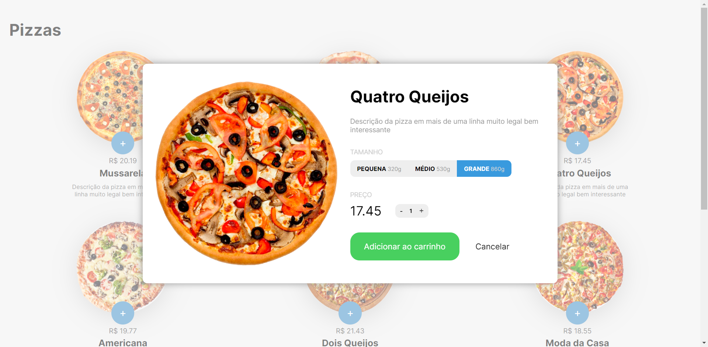
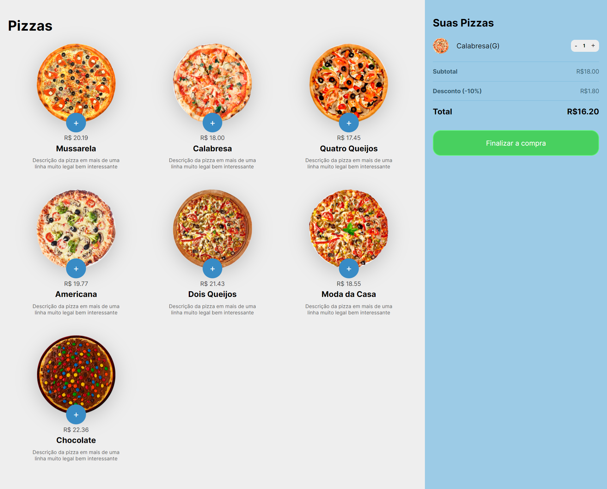

# Projeto compra de Pizzas :pizza

projeto desenvolvido durante o curso de javascript da B7web.

Habilidades utilizadas:

- Manipulação do DOM (document object model), possibilitando a adição das pizzas na tela, adicionando funcionalidades aos botões permitindo fechar e abrir o modal, adicionar e retirar os itens do carrinho e a exibição dos valores na tela.

- Métodos de Arrays, utilizados para manipular os itens no carrinho

- Simulação de JSON, arquivo utilizado para simular um JSON e adicionar as informações das pizzas.

- Conceitos Básicos de Lógica de Programação.

## Imagens

ao clicar em uma das pizzas:

carrinho de compras aberto:

